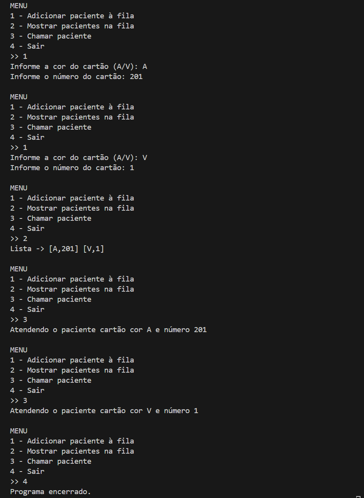

# Lista encadeada | Python

Trabalho para a disciplina Estrutura de Dados. 

O objetivo é criar um sistema de triagem para atendimento de emergência de hospital (menor ou maior grau de urgência):

<ul>
  <li>Pacientes com cartão numerado amarelo (A) são chamados antes dos pacientes com cartão numerado verde (V);</li>
  <li>Entre os pacientes com cartão amarelo (A), os que tem numeração menor são atendidos antes;</li>
  <li>Entre os pacientes com cartão verde (V), os que tem numeração menor são atendidos antes;</li>
  <li>As numerações dos cartões verdes (V) iniciam em 1;</li>
  <li>As numerações dos cartões amarelos (A) iniciam em 201;</li>
</ul>

Para isso, separei o projeto em algumas <a href="https://github.com/rebecaparreiras/lista-encadeada/tree/main/src">dependências</a>: 

<ul>
  <li><b>main.py:</b> ponto de entrada do programa, onde chama a função menu() para iniciar a interação com o usuário;</li>
  <li><b>menu.py:</b> contém a função menu(), que exibe as opções do sistema (adicionar paciente, mostrar fila, chamar paciente, sair) e chama os métodos da classe ListaEncadeada conforme a escolha do usuário;</li>
  <li><b>lista_encadeada.py:</b> contém a classe ListaEncadeada, responsável por gerenciar a fila de pacientes, incluindo métodos para inserir com ou sem prioridade, imprimir a fila e atender (remover) o paciente no início da fila;</li>
  <li><b>remocao.py:</b> contém a função remover_livro, que remove um livro da lista com base no ID;</li>
  <li><b>nodo.py:</b> contém a classe Nodo, que representa cada paciente na fila, armazenando o número do cartão, a cor e a referência para o próximo paciente.</li>
</ul>

## Preview

  

